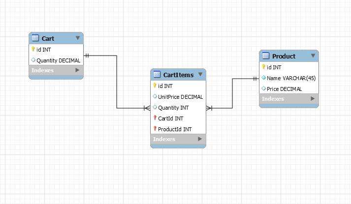
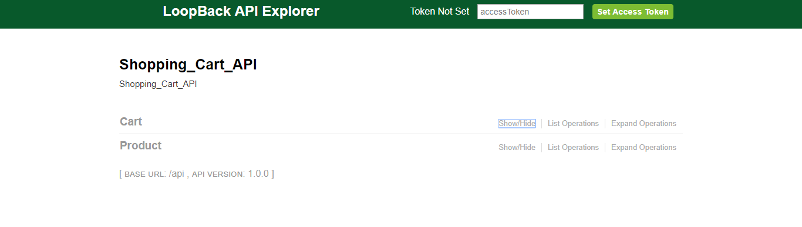
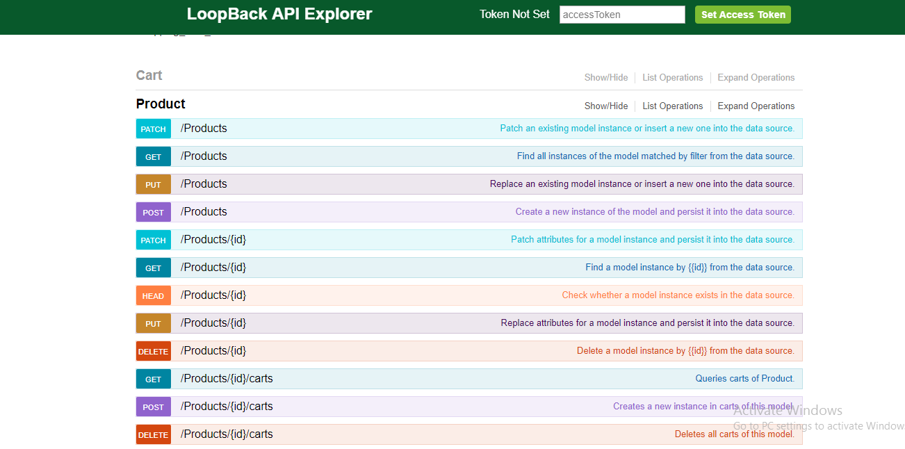
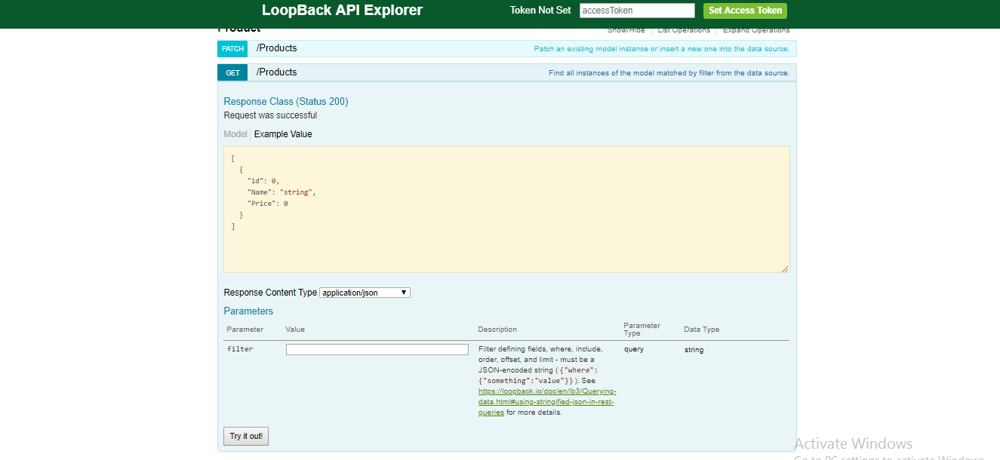
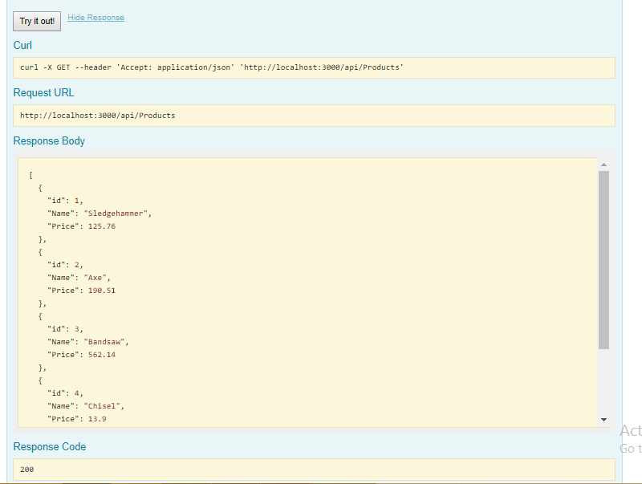
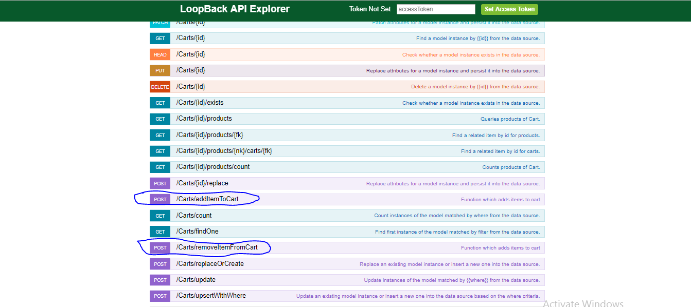
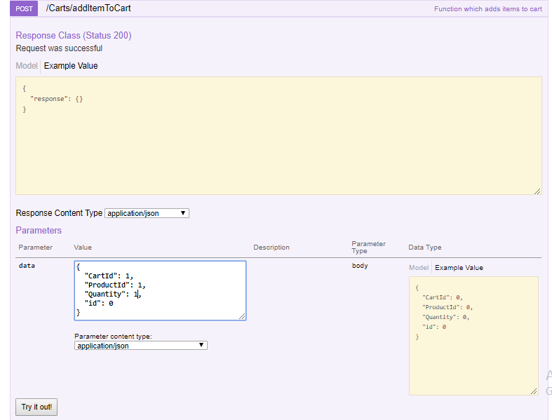
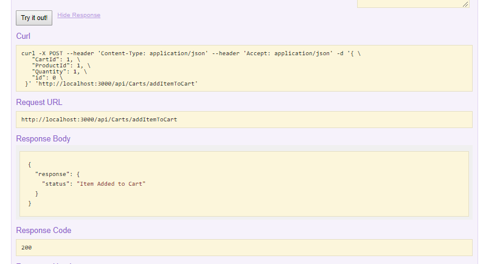
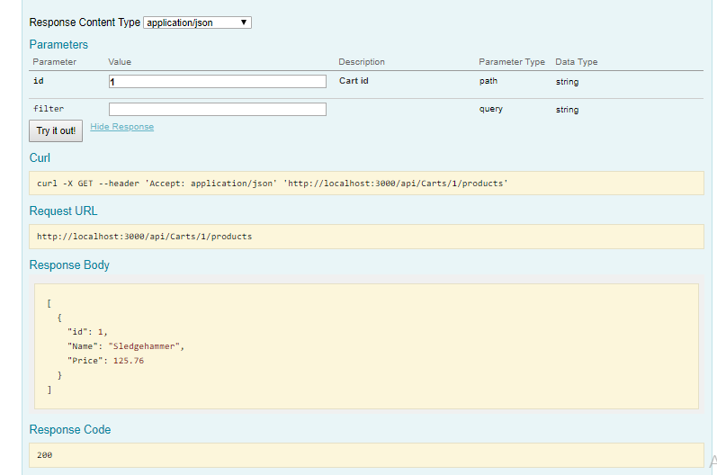
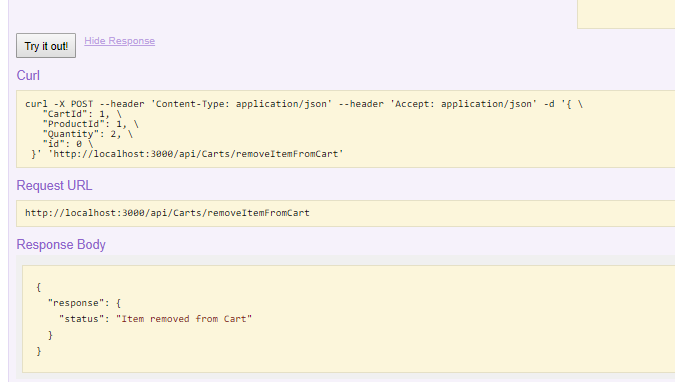

# Shopping_Cart_API

The project was built using Loopback 3

LoopBack is a highly-extensible, open-source Node.js framework that enables you to create dynamic end-to-end REST APIs with little or no coding.

# Schema

The model schema of the cart is found below:

The base idea was to create a many to many relationship between carts-and-products using CartItems in-between

# Instructions

run the following commands in order
1) npm install
2) npm start

if it doesn't run : please try the using the follwing command **npm install -g loopback-cli** before running npm start again

# API Tutorial

Once the application has started navigate to **http://localhost:3000/explorer** using the browser. You will be greeted with the below page.

The page has been generated using the Open API specfication UI module.

Two REST APIs have been exposed:

1) Product
2) Cart

## Products Section

Opening the Product API section will show the list of available exposed methods

The five basic products given in the requirements specification has already been added. They can be viewed by executing the **GET** method of the Products. To do so, click on the **GET** method. This will open a section which allows you to try executing the method and see the output. It provides many functionalities like allowing to add different inputs, and view the response of the methods. Below shows the **GET** method of the Products open.

Executing the method by pressing the **try-it-out** button returns the result of the method.

In the same way products can be added and removed using the **POST** and **DELETE** method. Other helper functions have been provided as well.

Eg: **GET /Products/{id}/carts** checks to see whether a product exists in any carts

## Cart Section

In the same vein the Cart section has several helper methods to manage the cart and cart items.

**Note**: It is possible to create multiple carts.

Once a cart has been created using the **POST** method (a single cart already exists for testing purposes), products can be added to the cart using **AddItemToCart** and removed using **RemoveItemFromCart**.

### Adding Items to cart

Clicking on the **AddItemToCart** shows opens the following sections

By filling the cart_id (which cart to add the product to), product_id (which product to add to the cart), and quantity (quantity of product) and executing the function it is possible to add a product to a cart.

Then by calling **GET /Carts/{id}/products** it is possible to view the products of that cart.

### Removing Items from Cart
Conversely by using **RemoveItemFromCart** it is possible to remove items. It is also possible to remove a certain quantity of a product as well from a cart using this function

## Disclaimer
It is recommended only use the **AddItemToCart** and **RemoveItemFromCart** functions unless you know what you are doing as directly adding cart items will not calculate the total correctly

# Database
As the developer was not sure of the availablity of the databases on the testing computer, a persistent in-memory DB provided by Loopback itself was used. The persisted data can be viewed in the **mydata.json** file.

# Note
loopback3 was used instead of loopback4 as Loopback4 does not yet implement a many-to-many relationshipp between models (that I required to connect the cart with the products)

https://github.com/strongloop/loopback-next/issues/1450